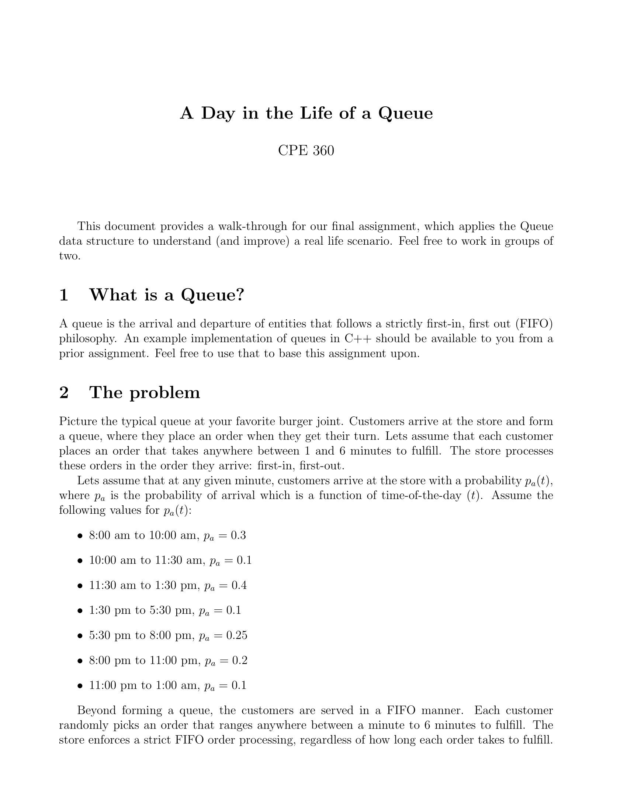
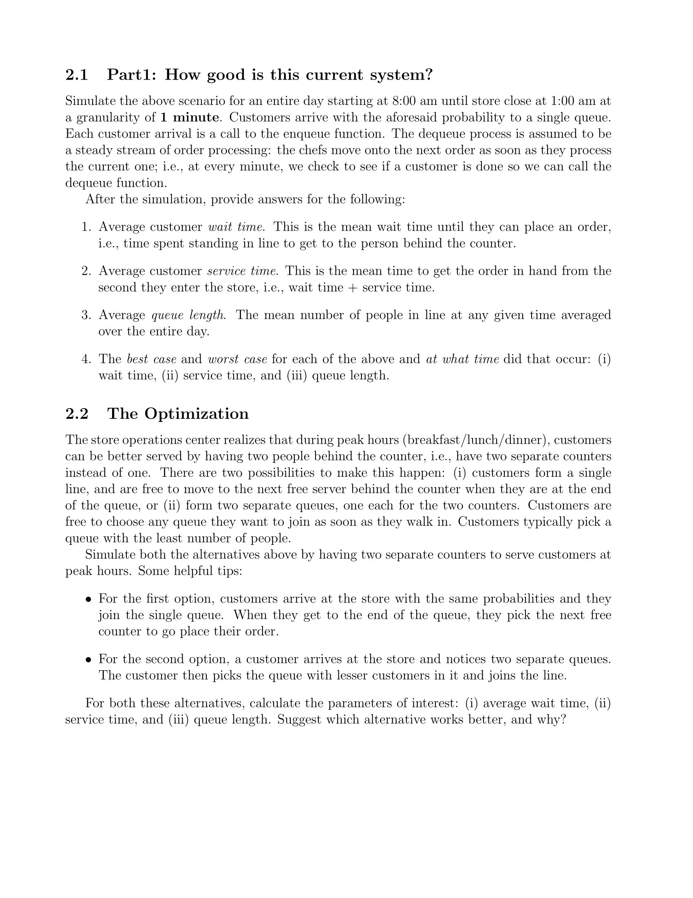

# CPE555-Queue-Project
Final project for data structures and algorithms

### How to run
1. open terminal
2. navigate to project directory
3. run "make" which creates an executable "output"
4. execute output

### Assignment Details

